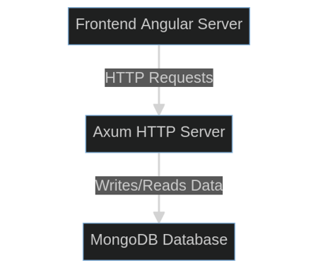
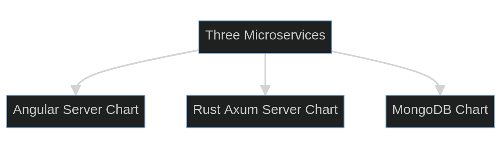
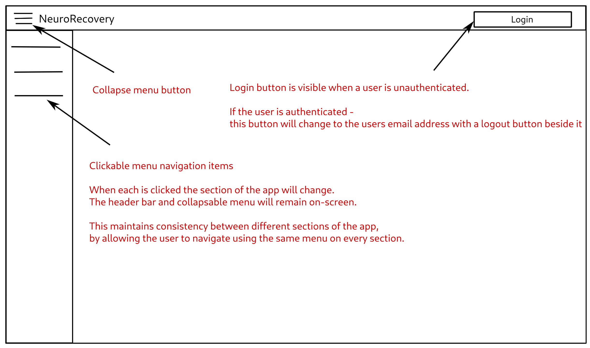
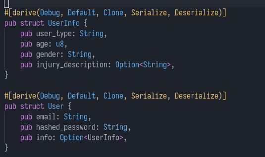
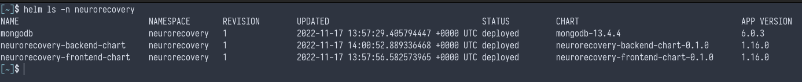
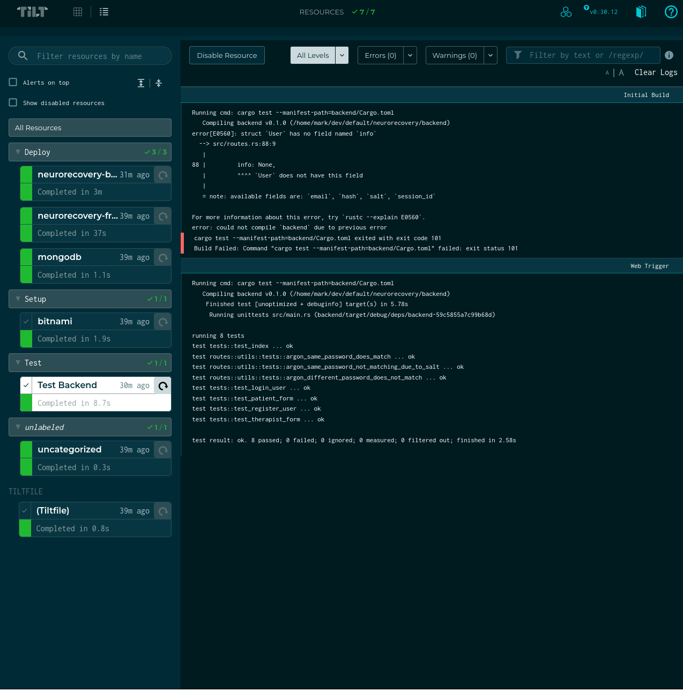

# Abstract
Strokes affect people worldwide, and in up to 40% of cases stroke survivors suffer from permanent upper limb paralysis [1]. Rehabilitation with physical practice in conjunction with mental practice been shown to lead to enhanced recovery of paralyzed limbs among stroke sufferers [2]. Yet rehabilitation with therapists can be expensive and difficult to travel to, so patients can not reach the full recovery possible in all cases.

The NeuroRecovery app aims to solve this gap, by allowing patients to access exercise sessions at home on any device that supports a web browser, such as phones or laptops. It also aims to increase remote connectivity between patients and therapists, by scheduling of exercise sessions followed by a video call with the therapist. This is expected to increase patients recovery from post-stroke upper and lower limb paralysis.

- [Abstract](#abstract)
- [Background](#background)
  * [Problem Statement](#problem-statement)
  * [Aims and Objectives](#aims-and-objectives)
    + [Aims](#aims)
      - [Instant Sessions](#instant-sessions)
      - [Scheduled Sessions](#scheduled-sessions)
      - [Demonstration Videos](#demonstration-videos)
      - [Notifications](#notifications)
      - [UI/UX](#ui-ux)
      - [Patient Data Storage and Authentication](#patient-data-storage-and-authentication)
    + [Objectives](#objectives)
- [Research and Analysis](#research-and-analysis)
  * [Literature Review](#literature-review)
    + [Developing an mHealth app for post-stroke upper limb rehabilitation](#developing-an-mhealth-app-for-post-stroke-upper-limb-rehabilitation)
    + [Italian Post-Stroke Checklist Software](#italian-post-stroke-checklist-software)
    + [Effect of Early Upper-Limb Training on Stroke Recovery](#effect-of-early-upper-limb-training-on-stroke-recovery)
  * [Investigatory Process](#investigatory-process)
    + [mHealth Considerations](#mhealth-considerations)
    + [Italian Post-Stroke Checklist Software Considerations](#italian-post-stroke-checklist-software-considerations)
    + [Effect of Early Upper-Limb Training on Stroke Recovery Considerations](#effect-of-early-upper-limb-training-on-stroke-recovery-considerations)
  * [Requirements Specification](#requirements-specification)
    + [Angular Material Frontend User Story](#angular-material-frontend-user-story)
    + [Rust Axum Backend User Story](#rust-axum-backend-user-story)
    + [MongoDB Data Storage User Story](#mongodb-data-storage-user-story)
    + [Kubernetes Deployment User Story](#kubernetes-deployment-user-story)
    + [Tilt Continuous Integration and Continuous Delivery User Story](#tilt-continuous-integration-and-continuous-delivery-user-story)
  * [Project Management](#project-management)
    + [Setup Tilt CI/CD with Kubernetes Phase](#setup-tilt-cicd-with-kubernetes-phase)
    + [Frontend Development Phase](#frontend-development-phase)
    + [Backend Development Phase](#backend-development-phase)
    + [Finalisation Phase](#finalisation-phase)
- [Design](#design)
  * [Frontend Design](#frontend-design)
    + [App Sections](#app-sections)
    + [User Interaction and Experience](#user-interaction-and-experience)
    + [Angular Material](#angular-material)
    + [Material](#material)
    + [NeuroRecovery as a Single Page Application](#neurorecovery-as-a-single-page-application)
  * [Backend Structure](#backend-structure)
    + [NoSQL Database Schema](#nosql-database-schema)
      - [Users Collection Schema](#users-collection-schema)
    + [Kubernetes Cluster](#kubernetes-cluster)
      - [Kubernetes Objects Utilised](#kubernetes-objects-utilised)
        * [Pods](#pods)
        * [Deployments](#deployments)
        * [ClusterIP Service](#clusterip-service)
        * [LoadBalancer Service](#loadbalancer-service)
    + [Tilt CI/CD](#tilt-ci-cd)
- [Summary](#summary)
- [References](#references)
- [Appendices](#appendices)
  * [Appendix C Code](#appendix-c-code)
  * [Appendix D Test Suite](#appendix-d-test-suite)

# Background
## Problem Statement
Globally over 20 million people suffer from stroke annually. In the UK there are 1.3 million stroke survivors, with 39 thousand stroke survivors in Northern Ireland alone. Up to 40% of stroke survivors suffer from permanent upper limb (UL) paralysis, which may affect their quality of life dramatically [3].

It has been clinically established that "using a rehabilitation protocol involving motor imagery (MI) practice in conjunction with physical practice (PP) of goal-directed rehabilitation tasks leads to enhanced functional recovery of paralyzed limbs among stroke sufferers." [2].

Generally stroke survivors will attend sessions with professional physiotherapists. However, attending physiotherapy sessions is expensive and limited to set dates. Additionally if exercises are performed with a physiotherapist's assistance, the patient may not apply his/her best effort in the rehabilitation tasks. This can result in inadequate neuroplasticity required for recovery of their motor function [2]. 

The NeuroRecovery app aims to enhance neuroplasticity related to motor function for patients, by providing an app to manage rehabilitation tasks which is accessible at all times on the patients phone or other device.

## Aims and Objectives
### Aims
Main aim is to provide management of motor rehabilitation tasks for stroke survivor patients with a webapp. The app will primarily focus on UL motor recovery, though it will provide supplementary sections for lower limb (LL) as well. This should be accomplished by providing demonstration videos, reminder notifications and consistent feedback to patients as they use the app. The app should be performant and cross-platform, allowing patients and therapists to access it on all devices that support a web browser.

#### Instant Sessions
To provide instant exercise sessions to the patient without prior scheduling is one of the most important features of the app. For this, the patient will not have access to a therapist through a video call or otherwise. Clear instructions and demonstration videos will be shown to the patient who can then carry out the full exercise session.

This allows patients to complete a clear exercise goal of completing one solo session without the need for a therapist who will not always be available to the patient. This is intended to increase neuroplasticity recovery as the patient will have exercise sessions available at all times.

Exercise sessions may require some tailoring based on the patient's data, such as reducing the intensity for patients who are elderly or have persistent hypertension, "There is a rationale for delaying moderate to higher intensity exercise in the elderly, as well as those with persistent hypertension and/or diabetes/hyperglycemia" [4].

#### Scheduled Sessions
It should support scheduling of appointments and exercise sessions, which may be followed by a video call with a therapist in some cases. Sessions should have default configurations so they can be created with minimal involvement on the patient or therapist's side, while also being configurable enough for sessions that require specific changes based on the patient's need.

#### Demonstration Videos
The app will have demonstration videos for the patient to watch during an exercise session. These videos should be vetted to include the correct exercise with timings that match the exercise session.

#### Notifications
Notifications should be triggered in situations where they have a clear intent, and avoided in situations where they are not necessary. The most common notification will be to remind the patient and therapist of an upcoming exercise session. Notifications have been found as a "mechanism to provide passive awareness rather than a trigger to switch tasks" [5], which is helpful in the situation of being reminded and aware of an upcoming exercise session. Without notifications, some users may actually spend more time checking an email or calendar for updates, "Turing off notifications cause some users to self interrupt more to explicitly monitor email arrival" [5].

#### UI/UX
The apps UI/UX should be clear and easily navigatable by patients. The user should be able to access the app through a web browser on any device.

#### Patient Data Storage and Authentication
The storage of patient information should follow the latest security standards for storing medical data. For the NeuroRecovery app, MongoDB will be used for data storage [6]. MongoDB is a well established NoSQL database, and follows latest security standards suitable for storing patient medical data. MongoDB must be configured correctly so that only authenticated access on the backend server will allow the updating or retrieving of data.

### Objectives
The NeuroRecovery app's objectives are as follows:

- Schedule exercise sessions and issue reminder notifications;
- Display timings for the patient to perform repetitive exercises in a specified order and frequency;
- Demonstrate the movements to the patient through a video;
- Storing of patient information, details of rehabilitation tasks and recovery outcomes;
- Providing neurofeedback in terms of changes in motor impairment to the patient.

# Research and Analysis
## Literature Review
There are many different existing programs or apps to assist with post-stroke UL recovery. These apps use a wide range of technologies, including Virtual Reality(VR) and even adaptation of gaming systems such as the Xbox towards recovery training [7].

### Developing an mHealth app for post-stroke upper limb rehabilitation
An existing paper has explored feedback from US and Ethiopian rehabilitation clinicians for the development of an mHealth app to assist with stroke recovery [8]. It is important to note that the paper cited was feedback-only, no specific mHealth app was developed. Another note is that the term mHealth(Mobile Health) is not specific to a single app, instead referring to the concept of a range of mobile apps related to healthcare [9].

Three app functionalities that received the perceived highest importance from respondents were: The rehabilitation team can modify the patients treatment plan, video-record arm function for later analysis and to automatically log and update performance in a number of factors [8]. This data will be important in deciding which features to include in the NeuroRecovery app.

Other features that are related to the NeuroRecovery app which were marked as "very important" but not as highly important as the previously mentioned features are: Display content in languages relevant to the country or region, remind users to complete their rehabilitation exercises or go to an in-person appointment and to display appointments [8]. Some features that are not relevant to the NeuroRecovery app itself are omitted from this discussion, such as displaying patient health insurance information or to allow the patient or caregiver to pay through the app for healthcare services.

### Italian Post-Stroke Checklist Software
An Italian post-stroke checklist (PSC) software has overlap with the NeuroRecovery app, especially in relation to collecting stroke patient information and parsing it into usable data. In comparison to using a physical paper questionnaire, the researchers found that "the web version of PSC had two important advantages: (1) clinicians may have an easy access to the PSC wherever they are visiting the patient just using a PC, a tablet, or a smartphone with an internet connection and (2) the data are saved on a database for further analyses." [10]. 

The findings of a PSC on a set of 42 post-stroke patients in the UK also highlights the unmet needs once they leave healthcare. 63.4% reported unmet secondary prevention needs, and 56.1% reported unmet mobility needs [10]. The NeuroRecovery app is targeting these post-stroke patients, who have left treatment but have unmet needs in relation to mobility and secondary prevention.

### Effect of Early Upper-Limb Training on Stroke Recovery
It is relevant for the NeuroRecovery app to consider the effects of exercise intensity and timing on neuroplasticity in patients. The investigated study was organised as follows, "The study recruited 23 participants. Of these, 12 were randomized to the standard-care group and had a mean age of 69.3 years, and 11 were randomized to the intensive training group and had a mean age of 61.7 years" [11].

The study found that between the standard and intensive care group, "There were no significant between-group differences in change over time in the clinical outcome scores" [11]. However, the intensive care group had slightly increased recovery in some areas, "This preliminary study is the first to show that more intensive rehabilitation (task-specific UL training) in the first month post-stroke is associated with increased brain activation in putative motor and attention areas" [11].

The study indicates that intensive care does increase neurorecovery in some areas, yet without any dramatic differences. The conclusion here is that the majority of the benefit can be achieved without deliberate intensive care. 

## Investigatory Process
### mHealth Considerations
mHealth was discussed in the literature review section due to it being a useful source of clinician perceived requirements in a mobile app for post-stroke patients.

As was previously discussed, the rating of certain features from the mHealth app study that are relevant to the NeuroRecovery will be taken into account. The highly rated feedback that will be developed for the NeuroRecovery app as a result of this, are:

- Appointment Scheduling and Reminders: The NeuroRecovery app should handle scheduling of appointments and reminders for both the patient and the therapist.
- Video-Record Exercises: Exercises performed by patient should have an option to be recorded, which a therapist can review at a later date.
- Language Features: The apps support to display in multiple languages. The NeuroRecovery app will aim to support the United Nations (UNs) six official languages which are Arabic, Chinese, English, French, Russian and Spanish [12].

The functionalities being reviewed by the clinicians for mHealth are quite broad, for example including a feature for displaying patient health insurance information. The NeuroRecovery app will focus on developing high quality features instead of a high quantity of features, so that they can be delivered in a reasonable time as a Minimum Viable Product (MVP). 

It may be enticing to aim for a large quantity of features in an app during its early stages, but this is likely to overload the developer(s) and result in slower development. Reaching an MVP is also highly important for receiving feedback on a product earlier, "To find and develop the right product that can help them become established and successful in the market, start-ups need to validate their minimum viable product (MVP) as quickly as possible until a product-market fit is attained" [13].

### Italian Post-Stroke Checklist Software Considerations
As was highlighted in the literature review, the PSC survey carried out in the UK showed that the majority of patients had unmet mobility needs and unmet secondary prevention needs after leaving treatment. Some of these patients who still have unmet needs post-treatment may wish to use the NeuroRecovery app, which will be more accessible and less expensive than returning to treatment.

Another consideration of the PSC is the advantages of it being available online, "The great advantage of using online PSC to unveil unmet needs was the administration to patients by general practitioners" [10]. The NeuroRecovery app should take this into account, and ensure that it is available online for both patients and therapists to easily access. This is expected to be accomplished by being available as a webapp that can be accessed through a URL by users.

The ability of the PSC to gather useful data from patients is also relevant to the NeuroRecovery app. An expected section of the NeuroRecovery app is to gather patient or therapist information through a web form. It may be relevant for the NeuroRecovery app to analyse this data in a similar form as the PSC.

### Effect of Early Upper-Limb Training on Stroke Recovery Considerations
As was discussed in the literature review, the intensity of UL training does not cause dramatically improved recovery of patients.

From the NeuroRecovery apps perspective, this implies that a focus should be made on having the patients complete the exercises consistently instead of a focus on exercise intensity. This is also because a webapp should not be expected to fill the abilities of an intensive physical post-stroke care group. Since a large recovery can be encouraged without intensive exercise the NeuroRecovery app intends to lean towards the solution of consistent non-intensive exercises.

## Requirements Specification
The requirements for the NeuroRecovery app will be described as user stories, which are informal descriptions of a software feature from the perspective of an end-user. 

The form used for user stories in this report will be a concise description followed by measurable and tangible acceptance criteria (AC) bullet points. Once development on a feature has completed, the AC will be reviewed and the user story closed if they have been fulfilled.

The user stories are placed in this report in no particular order. As will be discussed in the Project Management section, the user stories will be developed alongside each other concurrently as they are dependent on each other.

### Angular Material Frontend User Story
The frontend is expected to be aesthetically pleasing, clear and simple to navigate and be available as a cross-platform webapp. It should have code in it to handle communication with the backend, where required.

Acceptance Criteria:

- Built as a cross-platform webapp;
- Built with Angular framework using Material styling [14];
- Clear and simple to navigate;
- Contain all of the desired sections for the app, such as the instant exercise session section and the login form section;
- Backend communication such as when checking a users authentication credentials.

### Rust Axum Backend User Story
The backend server should handle user authentication and all communication with the MongoDB [15] database. It should be deployable as its own unit and is separate from the frontend and MongoDB.

Acceptance Criteria:

- Written in Rust using Axum framework [16];
- Useful logging;
- Performant under a high load of requests;
- Automated tests for all endpoints written;
- Handles interaction with the MongoDB database, through data models represented as Rust Structs;
- Exposes required functionality as HTTP endpoints that the frontend can call.

### MongoDB Data Storage User Story
MongoDB should be available for the backend server to interact with. MongoDB should be configured securely so that only the authenticated backend server can interact with it.

Acceptance Criteria:

- Deployed as a Helm [17] Chart in the same kubernetes cluster as the backend server;
- Accessible to the backend server on a static cluster IP. This IP must be set as static explicitly to avoid it changing dynamically for each deployment;
- Configured securely so that only authenticated connections are allowed.

### Kubernetes Deployment User Story
The app should be deployable on Kubernetes [18]. The app will consist of three separate microservices, the frontend, the backend and MongoDB. These microservices should be containerised and packed into Helm Charts, then deployed on a Kubernetes cluster.

This provides a deployment structure that can be replicated on any Kubernetes cluster. Without packing the microservices into Helm Charts, deployments may involve manually deploying the app for every change. This manual deployment may be acceptable if the app was to be deployed once, but during development and testing the app will be deployed likely hundreds of times. The general benefits of Kubernetes also apply, such as auto-restarting of failed containers etc. [18].

Acceptance Criteria:

- The three microservices that make up the app, the frontend, the backend and MongoDB are containerised and packed into Helm Charts;
- The Helm Charts can be deployed on a Kubernetes cluster successfully;
- Required configurations such as a static cluster IP for the MongoDB server are exposed in the Helm Charts.

### Tilt Continuous Integration and Continuous Delivery User Story
The developer should receive constant and automatic feedback on changes during development by a Continuous Integration system. Feedback will be in the form of successful or failed code builds, and also automated tests written for the backend. The entire app should be deployable with minimal involvement, by triggering a Continuous Delivery system.

This Continuous Integration and Continuous Delivery (CI/CD) system will be accomplished with Tilt [19], which has great support for deploying Helm Charts on Kuberentes clusters.

For example if the developer writes an update to a file in the backend source code, Tilt CI/CD will automatically recognise the change and re-build and re-deploy the backend server. The developer can then check the server once it has been deployed and review the change in a real deployment.

Acceptance Criteria:

- The developer can receive constant feedback using Tilt;
- The app can be deployed using Tilt;
- Automated tests are executed using Tilt.

## Project Management
The project management for the NeuroRecovery app will be set by phases. Phases in this report are intended to mean sets of related work to achieve a goal.

### Setup Tilt CI/CD with Kubernetes Phase
The goal of the setup phase is to have Tilt CI/CD running for the three microservices as early as possible in the apps development. The microservices at this point should have the minimum code required to deploy with basic interaction. The expected basic interaction of the backend server for example will be to have HTTP endpoints developed which interact with MongoDB (Figure 1).

This basic interaction allows verification that the setup phase has been successful, once Tilt CI/CD is automatically deploying the microservices and they can interact with one another on the Kubernetes cluster.

The reasoning for focusing on having Tilt CI/CD running early in the project is to maximise the benefit that it provides for all of the future developments.

### Frontend Development Phase
At this point the majority of the frontend microservice can be developed, yet there is no fundamental reason on why the frontend development phase should come before the backend development phase.

As the developer in this case though, the preference is to have a working frontend developed so that the required backend endpoints are extremely clear. For example, one of the first expected sections that the frontend will have developed is the register section. This section will have a form requesting desired email, and a password for this new account. It is then very clear that a backend HTTP endpoint to handle verifying and inserting a new user into the MongoDB database will be required for this section of the frontend.

Frontend development will be completed section by section. The initial focus will be on the authentication pages for login and register. Then the user section for updating patient or therapist information. Finally the exercise sections along with recovery monitoring and embedded videos will be developed, with optional therapist meeting scheduling.

### Backend Development Phase
Backend development can now be started, with the goal of supporting all of the HTTP endpoints that the frontend expects to exist.

The backend development phase will first involve adding suitable logging to the Rust Axum server. This will be accomplished with the standard log Rust crate [20], throughout the rest of the backend code logging statements will be added, allowing the developer to see when HTTP endpoints are called or errors with database interaction have occurred.

Next the HTTP endpoints themselves will be developed. The endpoint code will be functions that will return API responses in JavaScript Object Notation (JSON). The majority of endpoints developed will have code in the endpoint function that querys the MongoDB database.

Finally a set of automated tests will be written that will make mock HTTP requests against the endpoints to test their response. These automated tests will run as part of Tilt CI/CD, providing consistent feedback that the backend endpoints are working as expected after development changes.

### Finalisation Phase
When this stage is reached, the NeuroRecovery app will be functional. The deployment will be automatic through Tilt CI/CD, and both the frontend and backend will be running successfully. A user should be able to visit the frontend and make actions that involve backend interactions, such as registering a new user account.

The three microservices should have been developed and deployed on the Kubernetes Cluster as Helm Charts (Figure 2).

The finalistation phase will be to improve the app where possible and add following desired extra features:

- Improving the frontend for views on tablet and mobile screens;
- Adding new exercise videos or exercise session options such as custom timings;
- Adding thorough app documentation to a README.md in the code repo, which would describe exact instructions on how to deploy the app.

# Design
## Frontend Design
### App Sections
In the app's navigation menu, the following sections will be present for users to select between:

- Instant Exercise Session: Users can choose to start an exercise session immediately. This will allow users to complete a video-assisted exercise session without a therapist being present;
- Schedule Exercise Session: Users can schedule an exercise session for a specific time and date with a therapist. The scheduling will be integrated with Google or Outlook calendar [21][22];
- Update User Info: Section for a user to update their information. The user may be either a therapist or a patient, and the information requested will depend on this.

### User Interaction and Experience
The NeuroRecovery apps User Interaction and Experience(UI/UX) is intended to be straightforward for the user to navigate and interact with. The core of the UI/UX for this app is the toolbar at the top of the screen and the collapsable menu at the left of the screen. These two elements will be present in all sections, which provide navigation access and style consistency throughout the entire app.

The area of the screen that the content of each page appears in is referred to as the "section". For example when the user clicks the login button, a login form with a username and password field will be visible in the section. The storyboard below visually displays this concept (Figure 3).

The login form adheres to the UI/UX concept of the storyboard, with the toolbar and collapsable menu still visible while the user is in the login section (Figure 4).

When users visit the app they will be placed by default in the instant exercise session section. From there they can choose to login or go to a different section.

### Angular Material
The frontend is developed with the Angular framework using Google's material UI theme, referred to as "Angular Material" [14]. The language used for Angular is TypeScript, a super-set of JavaScript with strong types which compiles down to JavaScript to run in the browser [23]. Angular is a well-established frontend framework, with extensive use by Google who developed it originally and other major companies such as PayPal, Forbes and Samsung [24].

### Material
Material is a set of UI components and theming concepts developed by Google [25]. Google have specifically developed a Material package for the Angular framework, and apps that use this plugin are commonly referred to "Angular Material" apps. Material is utilised by a provided set of components which follow the theming and other behaviors such as animations. For example the collapsable menu in the NeuroRecovery app is a Material component called "MatSidenav" [26].

The NeuroRecovery app utilises Material components to provide a consistent theme, responsiveness between desktop and mobile devices and increase development speed by not having to develop a sidenav component for example.

### NeuroRecovery as a Single Page Application
Angular is used to create Single Page Applications (SPAs). In web development, SPAs reduce the amount of HTTP requests and responses between the user and the server. The first request from the user is responded to with a bundle which includes the entire apps frontend content, including JavaScript code. The user can then interact with the SPA without making further requests, despite switching between simulated pages which can be referred to as sections. Overall, the SPA architecture allows for a more refined experience for the end user and faster development times for the developer [27].

This concept is very visible in the NeuroRecovery app, the switching between the login form and the instant exercise section for example is seamless and instant, since both sections are already present in the user's browser without further HTTP requests.

While SPAs do make frontend interaction instantaneous, backend interaction from the frontend becomes more complex. Since the user will be interacting with bundled Javscript code in their browser, communication with the backend involves crafting and sending a HTTP request to the backend server from the user's browser. In a non-SPA, the user is always making HTTP requests directly to the backend to receive each page, and any backend only interaction such as database updating can be handled then.

## Backend Structure
### NoSQL Database Schema
The database utilised for the NeuroRecovery app is MongoDB, which is categorised as a NoSQL database. This contrasts with SQL databases which represent relational data in rows of tables. NoSQL databases represent non-relational data as a collection of documents. An alternative definition from Microsoft is "The term NoSQL refers to data stores that do not use SQL for queries." [28].

There is no traditional database schema defined for the data stored in MongoDB. Instead the data is represented by Rust Structs in the backend code, which are used when inserting, updating or retrieving data from a collection of documents.

MongoDB and NoSQL were chosen for the NeuroRecovery app due to its simplicity over SQL databases for development. The data is represented in the Rust backend code directly which involves less moving parts than having separate SQL files for schema applications to the database.

#### Users Collection Schema
The users struct consists of optional extra information with a mandatory username and secure hashed password (Figure 5):

### Kubernetes Cluster
The Kubernetes Cluster for the NeuroRecovery app consists of three microservices as discussed previously. The output of the `helm ls -n neurorecovery` command displays these three microservices (Figure 6):

Helm manages collections of objects that run on the Kubernetes Cluster. To see the underlying objects, the `kubectl get all -n neurorecovery` command will list all objects in the `neurorecovery` namespace (Figure 7):

#### Kubernetes Objects Utilised

##### Pods
A pod is the smallest unit in Kubernetes, it is a set of containers running together. In the NeuroRecovery app's case the three pods are at `1/1`, indicating that one container is successfully running in each. Each pod in this case is hosting a server each - the frontend is serving Angular, the backend is serving Rust Axum, and the database is serving MongoDB. These servers are exposed by the services which will be discussed.

Checking the logs of the backend and frontend pods running container (Figure 8):

##### Deployments
A deployment manages a pod. A pod can be deployed without a deployment, and if it was deleted or crashed, it would be gone. A pod deployed by a deployment though is under management, if the pod crashes it will be automatically replaced with a new equivalent pod. This is a core feature of Kubernetes Clusters, high availability even during crashes [29].

For example, on deleting the frontend pod while it is serving on `http://localhost:80`, there is no downtime and the HTTP requests continue to work as the deployment creates a new frontend pod (Figure 9):

##### ClusterIP Service
A ClusterIP service exposes the MongoDB pod on a static IP of `10.43.252.173`. A ClusterIP is only accessible from within the Kubernetes Cluster, which is a good security practice when only In-Cluster access is required. Services are used in Kubernetes since pods are temporary and can crash or be deleted, if the replacement pod returns the service will still be running.

Accessing MongoDB on the static ClusterIP (Figure 10):

##### LoadBalancer Service
Both the backend and frontend are exposed on a LoadBalancer service, which are bound to a port on the Kubernetes host computer. The frontend binds to the default HTTP webserver port 80, and the backend binds to port 8080.

Accessing the frontend server on `http://localhost:80` (Figure 11):

### Tilt CI/CD
Tilt CI/CD deploys the Helm Charts of the three microservices to the cluster. It has also been configured to execute the unit tests for the Rust Axum backend server as seen in the dashboard image below.

Some alternatives for Tilt were considered for this project, including Jenkins [30] and TravisCI [31]. Tilt was chosen over these options for its focus on Kubernetes and Helm Chart deployments, and its support for running on a local PC.

Most CI/CD solutions are based around setting up a server which multiple developers interact with, which is desired when a group of developers must use the same CI/CD solution. For the NeuroRecovery app though, since it is currently developed by one developer, a CI/CD solution was required that could run on a local PC; which Tilt handles well.

Tilt dashboard running on local PC with the backend server automated test logs open (Figure 12):

# Summary
In summary the NeuroRecovery app aims to assist patients to recover from post-stroke UL paralysis, with supplementary sections for LL paralysis. It will accomplish this through a webapp that users can access on any device that supports a web browser, such as phones or laptops.

Patients will be able to access instant exercise sessions and scheduled exercise sessions, allowing them to choose to exercise with or without a therapists assistance at all times. This is intended to increase neuroplasticity in patients as they will be able to access exercises at all times.

The overall plan for the project is set out in phases, setting up CI/CD first, then backend development of a Rust Axum server, then frontend development of an Angular Material server. Finally the finalistation phase will focus on improving the app where possible such as its appearance on mobile devices.

# References
1. World Health Organisation: Global Report (2002). Retrieved from <https://www.who.int/publications/i/item/9241562072>
2. Prasad G, Herman P, Coyle D, McDonough S, Crosbie, J: Applying a brain-computer interface to support motor imagery practice in people with stroke for upper limb recovery: A feasibility study, Journal of NeuroEngineering and Rehabilitation, 7:60 (2010).
3. Stroke Association: Stroke Statistics (2018). Retrieved from <https://www.stroke.org.uk/what-is-stroke/stroke-statistics>
4. Marzolini S, Robertson AD, Oh P, Goodman JM, Corbett D, Du X, MacIntosh BJ. Aerobic Training and Mobilization Early Post-stroke: Cautions and Considerations. Front Neurol. 2019 Nov 15;10:1187. doi: 10.3389/fneur.2019.01187. PMID: 31803129; PMCID: PMC6872678.
5. Shamsi T. Iqbal and Eric Horvitz. 2010. Notifications and awareness: a field study of alert usage and preferences. In Proceedings of the 2010 ACM conference on Computer supported cooperative work (CSCW '10). Association for Computing Machinery, New York, NY, USA, 27–30.
6. Firebase is an app development platform that helps you build and grow apps and games users love (2022). Retrieved from <https://firebase.google.com/>
7. K. Morrow, C. Docan, G. Burdea and A. Merians, "Low-cost Virtual Rehabilitation of the Hand for Patients Post-Stroke," 2006 International Workshop on Virtual Rehabilitation, 2006, pp. 6-10, doi: 10.1109/IWVR.2006.1707518.
8. Hughes CML, Padilla A, Hintze A, et al. Developing an mHealth app for post-stroke upper limb rehabilitation: Feedback from US and Ethiopian rehabilitation clinicians. Health Informatics Journal. 2020;26(2):1104-1117. doi:10.1177/1460458219868356
9. 15 Mhealth Apps That Are Disrupting Healthcare In 2022 (2022). Retrieved from <https://www.ideamotive.co/blog/mhealth-apps-that-are-disrupting-healthcare>
10. Iosa M, Lupo A, Morone G, Baricich A, Picelli A, Panza G, Smania N, Cisari C, Sandrini G, Paolucci S. Post Soft Care: Italian implementation of a post-stroke checklist software for primary care and identification of unmet needs in community-dwelling patients. Neurol Sci. 2018 Jan;39(1):135-139. doi: 10.1007/s10072-017-3140-1. Epub 2017 Oct 30. PMID: 29086123.
11. Hubbard IJ, Carey LM, Budd TW, et al. A Randomized Controlled Trial of the Effect of Early Upper-Limb Training on Stroke Recovery and Brain Activation. Neurorehabilitation and Neural Repair. 2015;29(8):703-713. doi:10.1177/1545968314562647
12. UN Official Languages (2022). Retrieved from <https://www.un.org/en/our-work/official-languages>
13. Nirnaya Tripathi, Markku Oivo, Kari Liukkunen, Jouni Markkula, Startup ecosystem effect on minimum viable product development in software startups, Information and Software Technology, Volume 114, 2019, ISSN 0950-5849
14. Angular Material (2022). Retrieved from <https://material.angular.io/>
15. MongoDB (2022). Retrieved from <https://www.mongodb.com/>
16. Axum (2022). Retrieved from <https://github.com/tokio-rs/axum>
17. Helm (2022). Retrieved from <https://helm.sh/>
18. Kubernetes (2022). Retrieved from <https://kubernetes.io/>
19. Tilt (2022). Retrieved from <https://tilt.dev/>
20. Rust Log (2022). Retrieved from <https://github.com/rust-lang/log>
21. Google Calendar (2022). Retrieved from <https://calendar.google.com>
22. Outlook Calendar (2022). Retrieved from <https://office.live.com/start/Calendar.aspx>
23. TypeScript (2022). Retrieved from <https://www.typescriptlang.org/>
24. 15 Top Amazing Websites Built With Angular Framework (2021). Retrieved from <https://www.angularminds.com/blog/article/apps-and-websites-built-using-angularjs-development-services.html>
25. Material Design (2022). Retrieved from <https://m3.material.io/>
26. Material MatSideNav (2022). Retrieved from <https://material.angular.io/components/sidenav/api>
27. Li, N. and Zhang, B., 2021, April. The Research on Single Page Application Front-end development Based on Vue. In Journal of Physics: Conference Series (Vol. 1883, No. 1, p. 012030). IOP Publishing.
28. Non-relational data and NoSQL. Retrieved from <https://learn.microsoft.com/en-us/azure/architecture/data-guide/big-data/non-relational-data>
29. Ferreira, A.P. and Sinnott, R., 2019, December. A performance evaluation of containers running on managed kubernetes services. In 2019 IEEE International Conference on Cloud Computing Technology and Science (CloudCom) (pp. 199-208). IEEE.
30. Jenkins (2022). Retrieved from <https://www.jenkins.io/>
31. TravisCI (2022). Retrieved from <https://www.travis-ci.com/>

# Appendices
## Appendix C Code
Source code is available to browse at github code repository: <https://github.com/mark-ruddy/neurorecovery>

## Appendix D Test Suite
Test suite covers the Rust Axum server backend, code is present in the `main.rs` file available at: <https://github.com/mark-ruddy/neurorecovery/blob/main/backend/src/main.rs>
